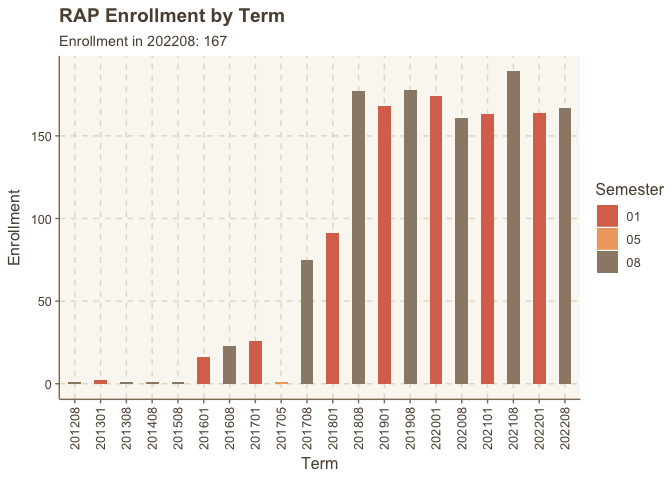
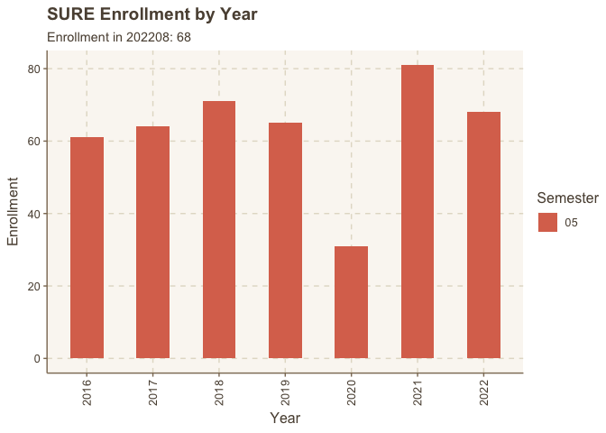

UGR Dashboard
================
AE Hessl
2022-09-09

### Data derived from WVU Registrar’s Office (Rebecca Tarabrella) collected after drop date at the beginning of each semester. Includes all 297, 497, and some 386, 471, 486 (CURs)

#### Students are only counted once per semester even if enrolled in multiple research courses.

## All Research Courses

<!-- -->

## RAP

<!-- -->

## SURE

<!-- -->
